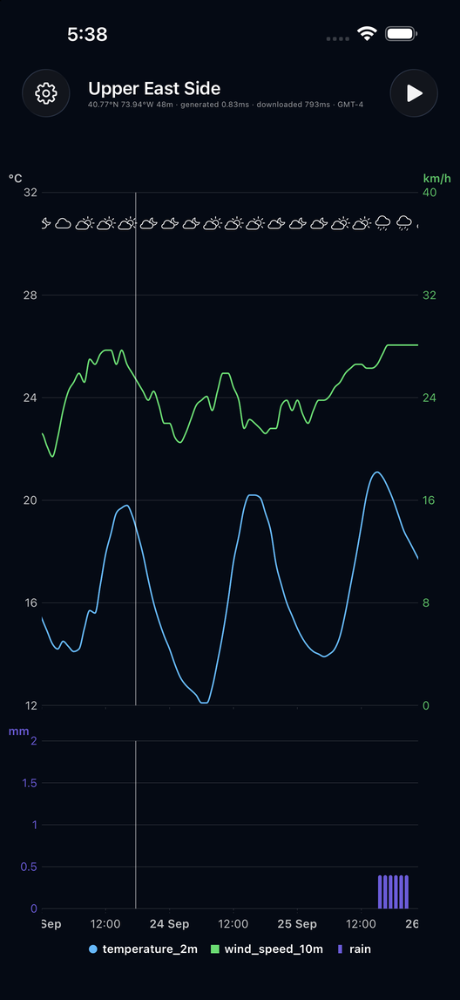

# UES Weather

맨해튼 Upper East Side 전용 개인 iPhone 날씨 앱.
[Open-Meteo](https://open-meteo.com) 차트 스타일을 SwiftUI + Swift Charts로 옮겼고, 예보가 시간에 따라 어떻게 바뀌었는지 재생해 볼 수 있습니다.



## 기능

- **기온 · 풍속 차트** — 좌측 °C, 우측 km/h 이중 축(같은 격자 공유), 상단 날씨 아이콘, 현재 시각 세로선
- **강수 막대 차트** — 시간당 강수량, 위 차트와 가로 스크롤·선택이 연동
- **값 확인** — 차트를 누르고 끌면 해당 시각의 값 표시
- **예보 변화 재생** (▶) — 과거 예보 → 현재 예보로 선이 부드럽게 변형
  - 저장된 스냅샷이 쌓이면 3시간 전 → 2시간 전 → 1시간 전 → 현재
  - 없으면 NBM 과거 모델 런(3시간 간격)을 자동 백필
- **새로고침** — 제목을 탭
- **설정** (⚙) — 단위(°C/°F, km/h/mph/m/s/kn, mm/inch), 표시할 그래프 선택
- **백그라운드 갱신** — 약 1시간마다 예보를 가져와 스냅샷으로 저장(48시간 보관)

## 데이터

| 용도 | API |
| --- | --- |
| 현재 예보 | `api.open-meteo.com/v1/forecast` |
| 과거 모델 런 (백필) | `single-runs-api.open-meteo.com/v1/forecast` |

- 모델: `ncep_nbm_conus` (NOAA National Blend of Models) — 매시간 갱신되고 과거 런이 보관되어 현재·과거 예보를 같은 모델로 비교할 수 있음
- 변수: `temperature_2m`, `wind_speed_10m`, `rain`, `weather_code`, `is_day`
- 위치: 40.7736, -73.9566 (`WeatherNYC/Forecast.swift`의 `Location`)
- 데이터는 항상 °C · km/h · mm로 받아 저장하고, 표시할 때 단위를 변환

## 빌드

요구 사항: Xcode 26+, iOS 26+, [XcodeGen](https://github.com/yonaskolb/XcodeGen)

```sh
xcodegen generate          # project.yml → WeatherNYC.xcodeproj
open WeatherNYC.xcodeproj
```

기기에 설치하려면 `project.yml`의 `DEVELOPMENT_TEAM`과 `PRODUCT_BUNDLE_IDENTIFIER`를 본인 것으로 바꾼 뒤 `xcodegen generate`를 다시 실행하세요.

앱 아이콘(칸딘스키 스타일, 차트와 같은 3색)은 스크립트로 생성합니다:

```sh
python3 scripts/make_icon.py   # Pillow 필요
```

## 구조

```
WeatherNYC/
├── WeatherNYCApp.swift   # 앱 진입점, 백그라운드 갱신 등록
├── ContentView.swift     # 상단 바, 재생 로직, 범례
├── ForecastChart.swift   # 기온·풍속 라인 차트 + 강수 막대 차트
├── Forecast.swift        # 모델, 단위 변환, Open-Meteo 클라이언트
├── SnapshotStore.swift   # 스냅샷 저장·백필·히스토리, BGAppRefreshTask
└── SettingsView.swift    # 설정 시트
```

## 참고

- iOS가 백그라운드 갱신 시점을 정하므로 정확히 매시간 실행되지는 않습니다. 앱을 강제 종료하면 멈추고, 저전력 모드에서는 드물게 실행됩니다.
- 과거 모델 런은 Open-Meteo가 3시간 간격으로만 보관하며 몇 시간 늦게 공개됩니다.
